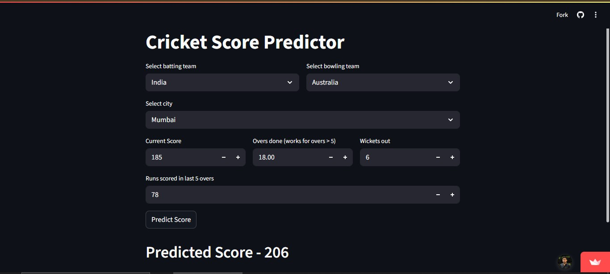

# 🏏 Cricket Score Predictor

A **Machine Learning-powered Cricket Score Prediction** app built with **XGBoost (XGBRegressor)** and **Scikit-learn**, deployed using **Streamlit** for an interactive web experience.  
This project predicts the cricket score based on match conditions and input features.

---

## 🚀 Features
- 🧠 Machine Learning model trained with **XGBoost**
- 📊 Real-time cricket score prediction
- 🌐 **Streamlit** web app for easy user interaction
- ⚡ Simple and fast deployment
- 💻 Lightweight & easy to run locally or on cloud

---

## 🛠️ Tech Stack

  
  
  
  

- **Python**
- **XGBoost** (`xgboost`)
- **Scikit-learn** (`scikit-learn==1.3.2`)
- **Streamlit** (`streamlit`)

## 📸 Output

  

## 🖥️ Also available as a standalone Windows app (.exe)

The same prediction logic and UI was also rebuilt with **Flask** and packaged into a single standalone `.exe` using PyInstaller — no Python install needed, just double-click and it opens in the browser locally. The Flask source isn't included in this repo (this repo stays Streamlit-focused); the packaged app is available as a direct download below.

  

**Download:** *dist/Circket_Score_Predictor.exe*

## 👤 Author
**Zahid Shaikh**  
- LinkedIn: [https://www.linkedin.com/in/skzahid90281/](https://www.linkedin.com/in/skzahid90281/)

---
